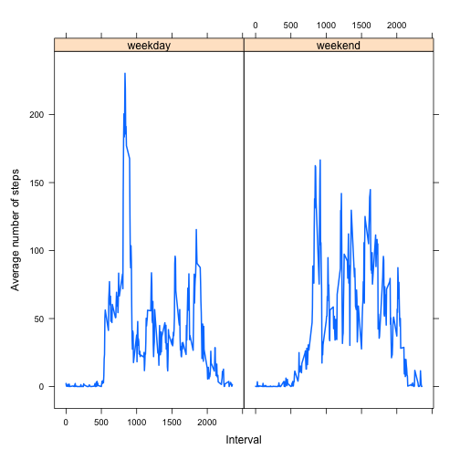

# Activity Monitoring Data Analysis

## Loading the data


``` r
data=read.csv(file = 'activity.csv')
head(data)
```

```
##   steps       date interval
## 1    NA 2012-10-01        0
## 2    NA 2012-10-01        5
## 3    NA 2012-10-01       10
## 4    NA 2012-10-01       15
## 5    NA 2012-10-01       20
## 6    NA 2012-10-01       25
```

## Preprocessing the data


``` r
data$date<-as.Date(data$date)
class(data$date)
```

```
## [1] "Date"
```

## What is mean total number of steps taken per day?
The sum of the steps taken per day

``` r
Steps_by_day <- data %>% group_by(date) %>% summarise(steps_h = sum(steps))
head(Steps_by_day)
```

```
## # A tibble: 6 × 2
##   date       steps_h
##   <date>       <int>
## 1 2012-10-01      NA
## 2 2012-10-02     126
## 3 2012-10-03   11352
## 4 2012-10-04   12116
## 5 2012-10-05   13294
## 6 2012-10-06   15420
```
Histogram of the steps taken per day

``` r
hist(Steps_by_day$steps_h)
```


The mean is :

``` r
mean(Steps_by_day$steps_h,na.rm=TRUE)
```

```
## [1] 10766.19
```
The median is :

``` r
median(Steps_by_day$steps_h,na.rm=TRUE)
```

```
## [1] 10765
```

## What is the average daily activity pattern?
Plotting

``` r
avg_step_interval <- aggregate(steps ~ interval, data = data, mean, na.rm = TRUE)
plot(avg_step_interval$interval, avg_step_interval$steps, type = "l", lwd = 2, col = "navy",
     main = "Average Number of Steps Taken", axes = FALSE,
     xlab = "Interval", ylab = "Average number of steps")
axis(1)
axis(2, las = 1)
```


 
The 5-minute interval, on average across all the days in the dataset, that contains the maximum number of steps is as follow :
 

``` r
avg_step_interval$interval[which.max(avg_step_interval$steps)]
```

```
## [1] 835
```

## Imputing missing values
The total number of missing values in the dataset:

``` r
sum(is.na(data$steps))
```

```
## [1] 2304
```
New data filling the missing values with the following strategy :
Using the mean from each interval to fill in the values missing from a sample

``` r
new_data <- data 
for (i in avg_step_interval$interval) {
    new_data[new_data$interval == i & is.na(new_data$steps),]$steps <- avg_step_interval$steps[avg_step_interval$interval == i]
}
head(new_data)
```

```
##       steps       date interval
## 1 1.7169811 2012-10-01        0
## 2 0.3396226 2012-10-01        5
## 3 0.1320755 2012-10-01       10
## 4 0.1509434 2012-10-01       15
## 5 0.0754717 2012-10-01       20
## 6 2.0943396 2012-10-01       25
```

Making a histogram of the total number of steps taken each day, calculating and reporting the mean and median total number of steps taken per day :


``` r
new_Steps_by_day <- new_data %>% group_by(date) %>% summarise(steps_h = sum(steps))
print(mean(new_Steps_by_day$steps_h))
```

```
## [1] 10766.19
```

``` r
print(median(new_Steps_by_day$steps_h))
```

```
## [1] 10766.19
```

``` r
hist(new_Steps_by_day$steps_h)
```


The mean remains consistent with the value obtained in the first part of the assignment, but the median differs slightly, despite being close in value. Imputing missing data with the average for each 5-minute interval introduces more data points equal to the mean, reducing the variability in the distribution. As a result, with many data points matching the mean, the median is more likely to converge toward the mean as well.

## Are there differences in activity patterns between weekdays and weekends?
Factoring the 

``` r
f <- new_data %>% mutate(weekday = ifelse(weekdays(date) %in% c("Saturday", "Sunday"), "weekend", "weekday"))
new_data$weekday<-f$weekday
new_data$weekday <- factor(new_data$weekday, levels = c("weekday", "weekend"))
head(new_data)
```

```
##       steps       date interval weekday
## 1 1.7169811 2012-10-01        0 weekday
## 2 0.3396226 2012-10-01        5 weekday
## 3 0.1320755 2012-10-01       10 weekday
## 4 0.1509434 2012-10-01       15 weekday
## 5 0.0754717 2012-10-01       20 weekday
## 6 2.0943396 2012-10-01       25 weekday
```

``` r
steps <- aggregate(steps ~ interval + weekday, data = new_data, mean)
xyplot(steps ~ interval | weekday, data = steps, type = "l", lwd = 2,
       xlab = "Interval", 
       ylab = "Average number of steps")
```


